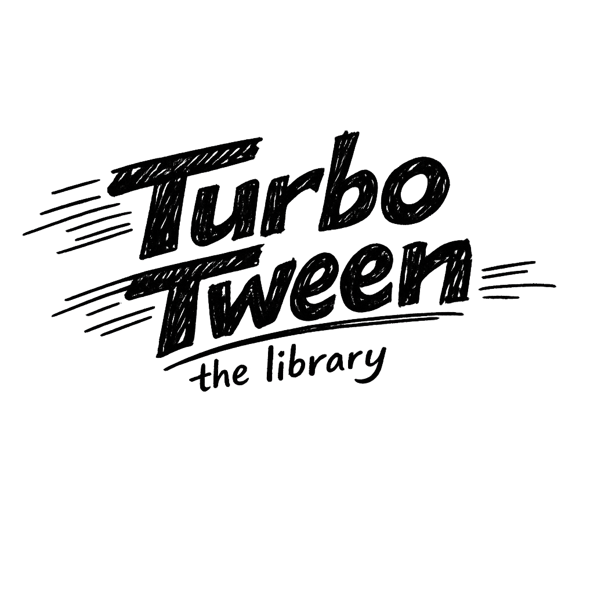

<p align="center">
  
</p>

<h1 align="center">Turbo-Tween</h1>

<p align="center"><strong>GSAP ergonomics in ~5KB.</strong> A lightweight, type-safe tweening library for modern web apps.</p>

- Zero dependencies
- First-class TypeScript
- SSR-safe (Nuxt, Next.js)
- Tree-shakeable easings (30 functions)
- Official Vue and React adapters
- Full playback control: pause, resume, reverse, seek
- Awaitable tweens (`await Tween.to(...)`)
- Timeline sequencing with stagger support

## Install

```bash
npm install @timbenniks/turbo-tween
# or
pnpm add @timbenniks/turbo-tween
# or
yarn add @timbenniks/turbo-tween
```

## Quick Start

### Vanilla

```ts
import { Tween, quadOut } from '@timbenniks/turbo-tween';

const el = document.querySelector('.box');

// Animate to target values
await Tween.to(el, 1000, { x: 200, opacity: 0.5, ease: quadOut });

// Animate from values to current
Tween.from(el, 500, { y: -50, opacity: 0 });

// Explicit start and end
Tween.fromTo(el, 800, { scale: 0 }, { scale: 1, ease: bounceOut });
```

### Vue

**Declarative (components):**

```vue
<script setup>
import { TweenTo, TweenTimeline } from '@timbenniks/turbo-tween/vue';
import { quadOut } from '@timbenniks/turbo-tween';
</script>

<template>
  <!-- Standalone: animates on mount -->
  <TweenTo :duration="1000" :to="{ x: 200, opacity: 0.5 }" :ease="quadOut">
    <div class="box">Click me</div>
  </TweenTo>

  <!-- Timeline: sequences children -->
  <TweenTimeline auto-play @complete="onDone">
    <TweenTo :duration="500" :to="{ x: 100 }">
      <div class="box1" />
    </TweenTo>
    <TweenFrom :duration="300" :from="{ opacity: 0 }">
      <div class="box2" />
    </TweenFrom>
  </TweenTimeline>
</template>
```

**Imperative (composable):**

```vue
<script setup>
import { ref } from 'vue';
import { useTween } from '@timbenniks/turbo-tween/vue';
import { quadOut } from '@timbenniks/turbo-tween';

const box = ref<HTMLElement>();
const { to, isAnimating } = useTween();

function animate() {
  to(box.value!, 1000, { x: 200, ease: quadOut });
}
</script>

<template>
  <div ref="box" @click="animate">Click me</div>
  <p v-if="isAnimating">Animating...</p>
</template>
```

### React

**Declarative (components):**

```tsx
import { TweenTo, TweenTimeline, TweenFrom } from '@timbenniks/turbo-tween/react';
import { quadOut } from '@timbenniks/turbo-tween';

function App() {
  return (
    <>
      {/* Standalone: animates on mount */}
      <TweenTo duration={1000} to={{ x: 200, opacity: 0.5 }} ease={quadOut}>
        <div className="box">Animated</div>
      </TweenTo>

      {/* Timeline: sequences children */}
      <TweenTimeline autoPlay onComplete={() => console.log('done')}>
        <TweenTo duration={500} to={{ x: 100 }}>
          <div className="box1" />
        </TweenTo>
        <TweenFrom duration={300} from={{ opacity: 0 }}>
          <div className="box2" />
        </TweenFrom>
      </TweenTimeline>
    </>
  );
}
```

**Imperative (hook):**

```tsx
import { useRef, useEffect } from 'react';
import { useTween } from '@timbenniks/turbo-tween/react';
import { quadOut } from '@timbenniks/turbo-tween';

function AnimatedBox() {
  const ref = useRef<HTMLDivElement>(null);
  const { to, isAnimating } = useTween();

  useEffect(() => {
    if (ref.current) {
      to(ref.current, 1000, { x: 200, ease: quadOut });
    }
  }, []);

  return <div ref={ref}>Animated</div>;
}
```

## API

### `Tween.to(target, duration, options)`

Animate properties from their current values to the specified values.

```ts
const tween = Tween.to(element, 1000, {
  x: 100,
  y: 50,
  opacity: 0.8,
  ease: cubicOut,
  delay: 200,
  onComplete: () => console.log('done'),
});
```

### `Tween.from(target, duration, options)`

Animate properties from the specified values to their current values.

```ts
Tween.from(element, 500, { opacity: 0, y: -20, ease: quadOut });
```

### `Tween.fromTo(target, duration, fromVars, toVars)`

Animate between explicit start and end values.

```ts
Tween.fromTo(element, 800, { x: -100 }, { x: 100, ease: backOut });
```

### Tween Instance

All `Tween.to/from/fromTo` return a `TweenInstance`:

```ts
tween.pause();
tween.resume();
tween.reverse();
tween.seek(500); // jump to 500ms
tween.kill();
tween.progress; // 0..1
tween.isActive; // boolean
tween.isPaused; // boolean
tween.isReversed; // boolean
tween.duration; // ms
tween.currentTime; // ms
tween.completed; // boolean
await tween; // resolves on completion
```

### Timeline

Sequence multiple tweens with controlled timing:

```ts
import { Timeline, stagger, quadOut } from '@timbenniks/turbo-tween';

const tl = new Timeline({ defaults: { ease: quadOut } });

tl.to(el, 500, { x: 100 }).to(el, 500, { y: 200 }).from(other, 300, { opacity: 0 });

tl.play();
await tl;
```

Stagger multiple elements:

```ts
const elements = document.querySelectorAll('.item');

tl.staggerTo(
  [...elements],
  400,
  { opacity: 1, y: 0 },
  stagger(100), // 100ms between each
);

// Or stagger from center:
tl.staggerTo(items, 400, { scale: 1 }, stagger(80, { from: 'center' }));
```

Timeline playback:

```ts
tl.pause();
tl.resume();
tl.reverse();
tl.seek(1500);
tl.kill();
tl.progress; // 0..1
tl.isPaused;
tl.isReversed;
tl.isPlaying;
tl.duration;
```

### Declarative Components

Both Vue and React ship declarative components that animate on mount. When nested inside a `TweenTimeline`, they register as timeline steps instead.

| Component       | Props                                        | Description                      |
| --------------- | -------------------------------------------- | -------------------------------- |
| `TweenTo`       | `to`, `duration?`, `ease?`, `delay?`         | Animate to target values         |
| `TweenFrom`     | `from`, `duration?`, `ease?`, `delay?`       | Animate from values to current   |
| `TweenFromTo`   | `from`, `to`, `duration?`, `ease?`, `delay?` | Explicit start and end           |
| `TweenTimeline` | `autoPlay?`, `defaults?`                     | Sequences child tween components |

Timeline exposes playback controls via ref:

```ts
// Vue: template ref
const tl = ref();
// <TweenTimeline ref="tl">...</TweenTimeline>
tl.value.pause();
tl.value.seek(500);

// React: useRef + forwardRef
const tl = useRef<TweenTimelineHandle>(null);
// <TweenTimeline ref={tl}>...</TweenTimeline>
tl.current?.pause();
tl.current?.seek(500);
```

### Overwrite Modes

Control what happens when a new tween targets the same object:

```ts
// Kill all existing tweens on the same target
Tween.to(el, 500, { x: 100, overwrite: 'all' });

// Kill only tweens with overlapping properties
Tween.to(el, 500, { x: 100, overwrite: 'auto' });

// Don't kill anything (default)
Tween.to(el, 500, { x: 100, overwrite: 'none' });
```

### Global Methods

```ts
Tween.killAll(); // Stop all active tweens
Tween.killTweensOf(element); // Stop tweens on a specific target
```

## Transform Shorthands

These shorthands map to CSS `transform` and are composed in this order:
**translate -> rotate -> skew -> scale**

| Shorthand  | CSS equivalent                        |
| ---------- | ------------------------------------- |
| `x`        | `translateX()`                        |
| `y`        | `translateY()`                        |
| `z`        | `translateZ()` (triggers translate3d) |
| `scale`    | `scale()` (sets both X and Y)         |
| `scaleX`   | `scaleX()`                            |
| `scaleY`   | `scaleY()`                            |
| `rotation` | `rotate()`                            |
| `skewX`    | `skewX()`                             |
| `skewY`    | `skewY()`                             |

## Easings

All 30 easing functions are tree-shakeable named exports:

```ts
import { quadOut, elasticOut, bounceInOut } from '@timbenniks/turbo-tween';
```

| Family  | In          | Out          | InOut          |
| ------- | ----------- | ------------ | -------------- |
| linear  | `linear`    | -            | -              |
| quad    | `quadIn`    | `quadOut`    | `quadInOut`    |
| cubic   | `cubicIn`   | `cubicOut`   | `cubicInOut`   |
| quart   | `quartIn`   | `quartOut`   | `quartInOut`   |
| quint   | `quintIn`   | `quintOut`   | `quintInOut`   |
| sine    | `sineIn`    | `sineOut`    | `sineInOut`    |
| expo    | `expoIn`    | `expoOut`    | `expoInOut`    |
| circ    | `circIn`    | `circOut`    | `circInOut`    |
| back    | `backIn`    | `backOut`    | `backInOut`    |
| elastic | `elasticIn` | `elasticOut` | `elasticInOut` |
| bounce  | `bounceIn`  | `bounceOut`  | `bounceInOut`  |

Custom easings are simple functions:

```ts
const myEase = (t: number) => t * t * t; // cubic
Tween.to(el, 1000, { x: 100, ease: myEase });
```

## Plain Object Animation

Turbo-Tween can animate any object, not just DOM elements:

```ts
const camera = { x: 0, y: 0, zoom: 1 };

await Tween.to(camera, 2000, {
  x: 500,
  y: 300,
  zoom: 2.5,
  ease: quadInOut,
  onUpdate: () => renderScene(camera),
});
```

## SSR Safety

Turbo-Tween is SSR-safe out of the box. On the server, all tween calls return no-op instances that resolve immediately. No guards needed in your components.

## Bundle Size

Measured with [size-limit](https://github.com/ai/size-limit) (minified + brotli):

| Entry                | Size    |
| -------------------- | ------- |
| Core (`@timbenniks/turbo-tween`) | ~4.5 KB |
| Core + timeline      | ~9 KB   |

The Vue and React adapters add minimal overhead (~1 KB each) and re-use the core.

## Comparison

|            | Turbo-Tween | GSAP            | Motion      | anime.js  |
| ---------- | ----------- | --------------- | ----------- | --------- |
| Size       | ~5KB        | ~25KB           | ~18KB       | ~17KB     |
| TypeScript | Native      | Retrofit        | Native      | Community |
| SSR safe   | Yes         | Requires guards | Yes         | No        |
| License    | MIT         | Custom          | MIT         | MIT       |
| Adapters   | Vue + React | Community       | React-first | None      |

## License

MIT
